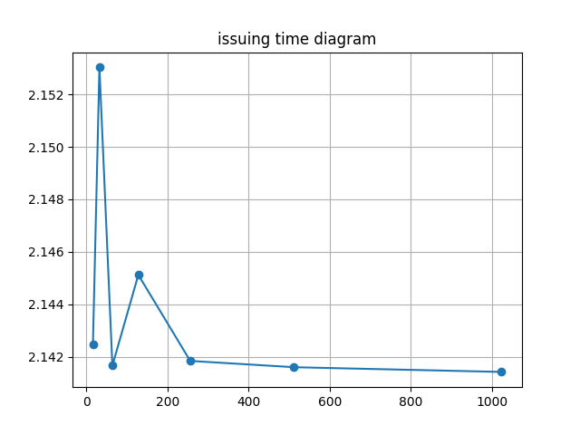

# Note for Experiment on April 13
Before the experiment, the two tables in db are dropped and then created again
During the experiment, Faker will generate fake profile of holder of certificate 

By measuring the response time in python requests package, we can measure the e2e time 

## Table for experiments trial 1 on local backend

|no. of cetificates in series | $2^4$   |   $2^5$  |  $2^6$   |   $2^7$  |   $2^8$  |   $2^9$ |   $2^{10}$  |
|:-----------:|:----:|:----:|:----:|:----:|:----:|:----:|:----:|
|issuing time | 2.14248    |   2.15303  |  2.14166  |   2.14512 |  2.14184  |  2.14160 |   2.14142  |
|upload time | 4.14365    |   5.961865  |  9.659636   |   17.102032  |   32.155559  |   61.493748 |  120.608905  |

problem:
person countryID is A1234567(8) while actual hkid is A123456(7)

# Note for Meeting on April 12
### 1. Issuing certificate locally
Average time for issuing certificate: 2.165s

done test more on 2^n n=4...10  
### 2. Upload Certificate
Upload 10 certificates: 3.492s

done test more on 2^n n=4...10

### 3. Communication between client and backend
After verif. on local, before on global. Communication between client and backend server: later

### 4. Tree
how much for tree generation

### 5. QR code
how much for qr code gen.

how much time for refreshing qr code

### 6. Verify on Local Chain 
later

### 7. Verify on global chain: 0.014s
2^n n=4...10 for cert

### 8. Verify from qrcode to backend 

### 9. e2e system tests 